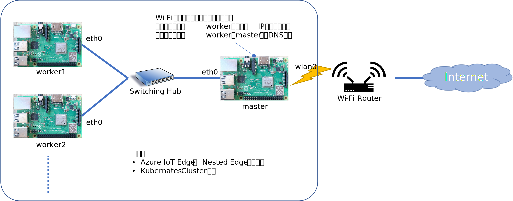

# Raspberry Pi で DNS Server、DHCP Server を設置し、ローカルネット接続された機器群と連携する  
Azure IoT Edge の Nested Edge や、K8s cluster の構成などのお試しで、簡易のローカルネットワークで複数の Linux 機器を接続し、そのローカルネットワーク内だけで IPアドレスをそれぞれの機器に割り当てて、相互に FQDN で参照しあいたいような環境が必要な場合の構築方法を試してみたので、方法を以下に紹介する。  
構成は以下の通り。  
  
便宜上、Wi-Fi でインターネットに接続された Raspberry Pi の名前を <b>master</b> 、Switching Hub を介してローカルに接続される Raspberry Pi の 名前を <b>worker<i>N</i></b>（<i>N</i>は、1から始まる自然数）とする。  

設定手順は以下の通り。  
1. Raspberry Pi のインストール   
1. master の eth0 の static IP address 設定  
1. DNS Server、DHCP Server のインストールと設定  


## Raspberry Pi のインストール  
OS のインストールなどは、raspberry pi のサイトに従って普通に行う。  
名前の変更は、
```sh
sudo raspi-config
```
で設定アプリを起動し、
1. System Options  
1. Hostname  

の順番に選択して、それぞれの名前に変更する。  
worker<i>N</i> の IP Address を static にしたい場合は、それぞれの MAC Address を調べてメモしておく。  


## master の IP Address を static 化する。  
/etc/dhcpcd.conf に以下のテキストを追加する。  
```
interface eth0
static ip_address=192.168.0.200/24
static routers=192.168.68.1
static domain_name_servers=192.168.68.1 8.8.8.8 fd51:42f8:caae:d92e::1
```
"192.168.0.200" は、各自の設定したい IP Address に変えてよい。
routers と domain_name_servers の "192.168.68.1" の部分は、各自の Wi-Fi Router の IP Address に合わせて適宜変更する事。  
修正完了後 Reboot すると有線接続（eth0）の IP Address が指定したものに変わる。  
```
pi@master:~ $ ip addr show
...
2: eth0: <NO-CARRIER,BROADCAST,MULTICAST,UP> mtu 1500 qdisc pfifo_fast state DOWN group default qlen 1000
    link/ether b8:27:eb:xx:yy:zz brd ff:ff:ff:ff:ff:ff
    inet 192.168.0.200/24 brd 192.168.0.255 scope global noprefixroute eth0
       valid_lft forever preferred_lft forever
...
```
※ Switching Hub への有線接続と電源 ON を忘れない事。  

## master 上での DNS Server、DHCP Server の設置  
設定が比較的簡単で結構たくさんの技術ブログで紹介されている、DNS、DHCP 両方の機能を持つ、[dnsmasq](https://thekelleys.org.uk/dnsmasq/doc.html) を使って運用する。  
dnsmasq のインストール方法は以下の通り。  
```
sudo apt-get update
sudo apt-get install dnsmasq -y
```
インストールが終わるとサービスが動き出すので、一旦止める。  

```
sudo service dnsmasq stop
```

/etc/dnsmasq.conf に以下の設定を追加する。  
```
conf-file=/etc/dnsmasq.more.conf
```
この設定で、dnsmasq 起動時に /etc/dnsmasq.more.conf が読み込まれるので、以下のような内容で作成する。  
```
domain-needed
bogus-priv
local = /local/
domain = local
expand-hosts

dhcp-range = eth0,192.168.0.201,192.168.0.254,255.255.255.0,12h

dhcp-option = option:router, 192.168.68.1
dhcp-option = option:dns-server, 192.168.0.200, 192.168.68.1
dhcp-option = option:ntp-server, 192.168.68.1

dhcp-host = b8:27:eb:xx:yy:zz, worker2, 192.168.0.202, infinite
dhcp-host = b8:27:eb:ss:tt:uu, worker3, 192.168.0.203, infinite
```
dhcp-range は、DHCP Server が割り振る IP Address の範囲である。この例では、102.168.0.201 から 192.168.0.254 までと指定している。  
この 192.168.0.の前3桁の部分は、前のステップで設定した static IP Address と同じでなければならない。違う値を設定すると、
```
Dec 24 14:54:45 kubemaster dnsmasq-dhcp[566]: no address range available for DHCP request via eth0
```
というエラーメッセージが表示される。  
※ ネットワーク設定に詳しい人なら、当たり前のことかもしれないですが。  
dhcp-option で設定している各 IP Address は、それぞれの環境に合わせ、使っている Wi-Fi Router の値を設定する。  
dhcp-host で指定しているのは、worker<i>N</i> の IP Address の固定化である。  
```
<MAC Address>, <hostname>, <割り当てたい IP Address>, infinite 
```
で、固定化できる。  
これで設定は完了。  

```
sudo service dnsmasq start
```
で、dnsmasq を起動してめでたしめでたし。  
## 動作確認  
master、worker<i>N</i> を有線で Switching Hub に接続し、電源を ON にする。worker<i>N</i> の eth0 の IP Address が、dnsmasq で設定したアドレスになっていることが確認でき、    
```
ping 192.168.0.2xx
```  
で、双方向通信可能な事が確認できたら設定は完了。  
因みに、ping の際、master 上で  
```
ping worker<i>N</i> 
ping worker<i>N</i>.local 
```
といった形式でも通信可能。  
worker<i>N</i> 側でも、  
```
ping master
ping master.local
```
でも通信が可能である。  
この環境で、https://github.com/ms-iotkithol-jp/NestedEdgeOnRaspberryPi で紹介している Nested Edge も動くはずである。ローカルネットワーク内で DNS Server もあるので、Gateway ホスト名は、FQDN 形式でも設定が可能のはずである。  
